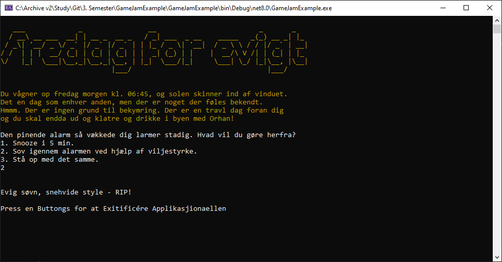

# GameJamExample
Our 3. Semester GameJam with the new 1. Semester pepos

Theme:  Escape the Simulation

This is meant as a sort of alternatively-structured example of avoiding code duplication, by creating an Event-class which can be used to handle all the textual scenarios that occur in the game (without repeatedly creating a method for each one, so Program.cs grows excessive).

Uploaded here since we didn't add contributors to the initial git-repo @ https://github.com/JeppeMarek/GameJam

This project took home the third place of the game jam!

<h3>Final release included these features:</h3>
- Music on a separate thread, using the 'NAudio' NuGet package 
- Progressively-written headline 
- Game reboot input, either during the game or after a death-message 
- Insta-win cheat code 

* Note: Some of these features might not be present in the current version, due to git-pushing practice done during the project.

<h2>Screenshots</h2>

A more final-stage version, with text-coloring, music & slightly more fancy headline.

 
 

An early-stage screenshot, text-oriented.

